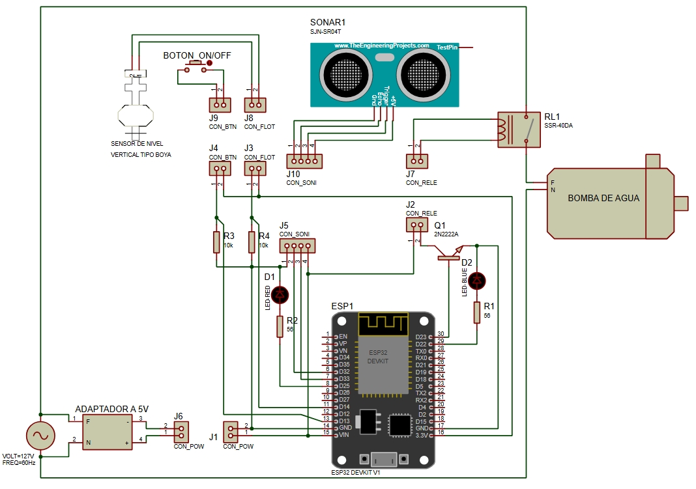
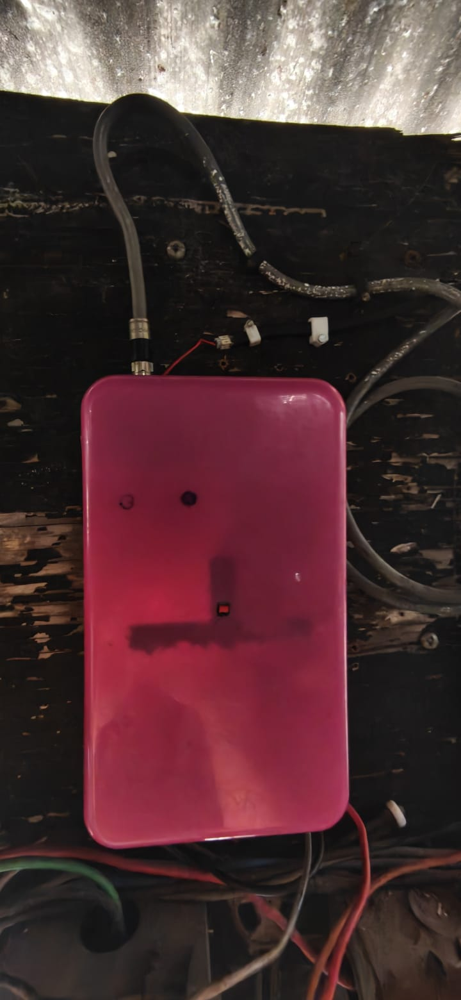
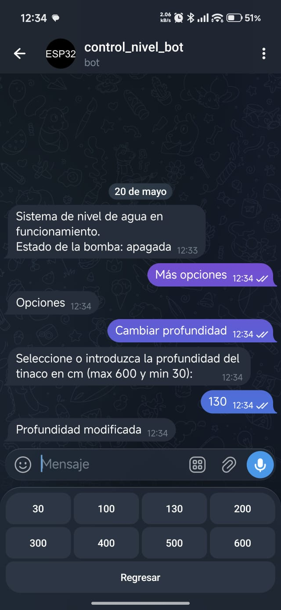
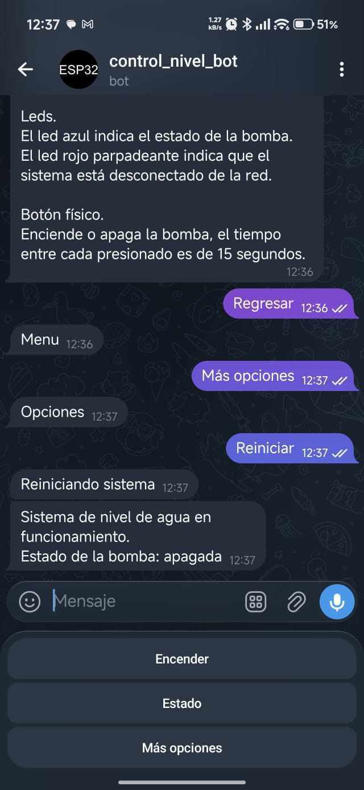

# Sistema De Nivel De Agua
Sistema IoT con ESP32 para control de agua. Controla una bomba AC mediante un relevador activado por tres vías: mensaje de Telegram (Manual), cuando el nivel llega al 15% (Automático) o pulsador físico (Offline). Monitorea porcentaje con ultrasonido y usa un sensor de nivel físico  para apagar la bomba cuando se llega al limite del recipiente.

##  Diagrama de Conexiones
Aquí se detalla cómo interactúa el ESP32 con los sensores y el actuador de potencia:

* **Sensor ultrasónico:** Para conocer el porcetaje del nivel del agua.
* **Sensor de nivel (flotador tipo boya):** Para emitir la señal de que el agua ha llegado al limite.
* **Boton:** Para encender o apagar la bomba de agua manualmente sin el uso de Telegram.
* **LED rojo:** Para conocer el estado del wifi (parpadea: desconectado y apagado: conectado).
* **LED azul:** Para conocer el estado de la bomba de agua.
* **Relevador:** Controla el encendido y apagado de la bomba de agua mediante una señal emitida por el  ESP32.

##  Prototipo
Así luce el sistema ensamblado y operando en el depósito de agua y en el área de control:

##  Menu
Así luce el menu de Telegram:

